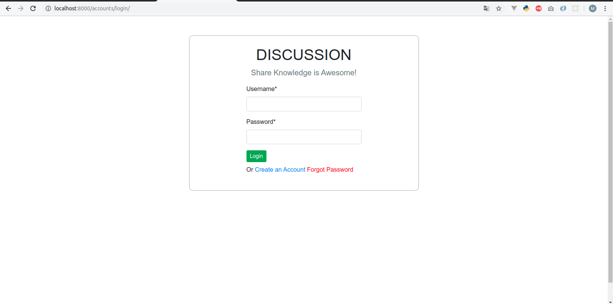
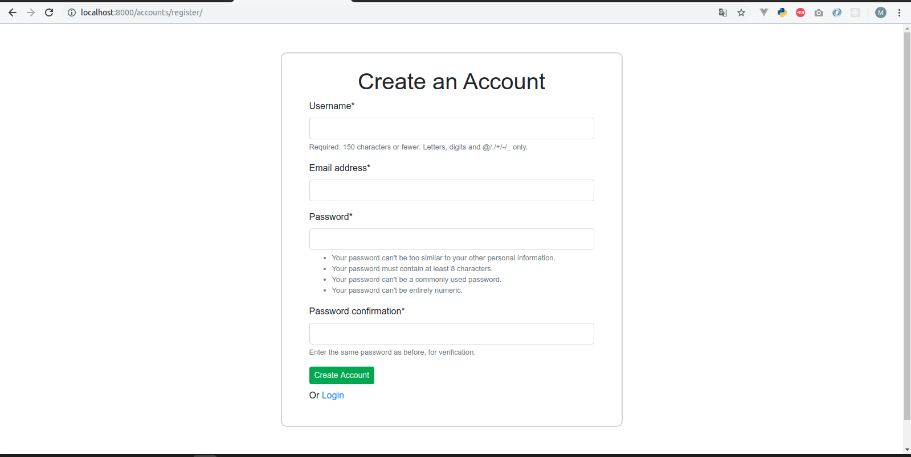
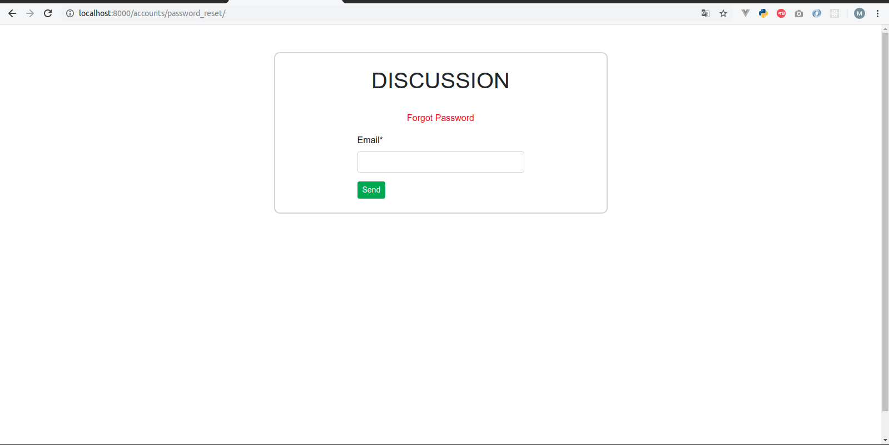
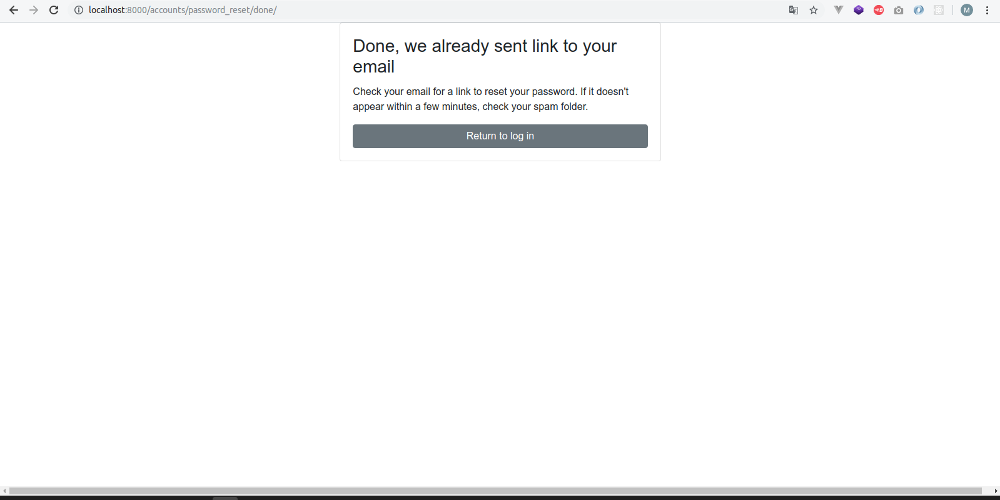
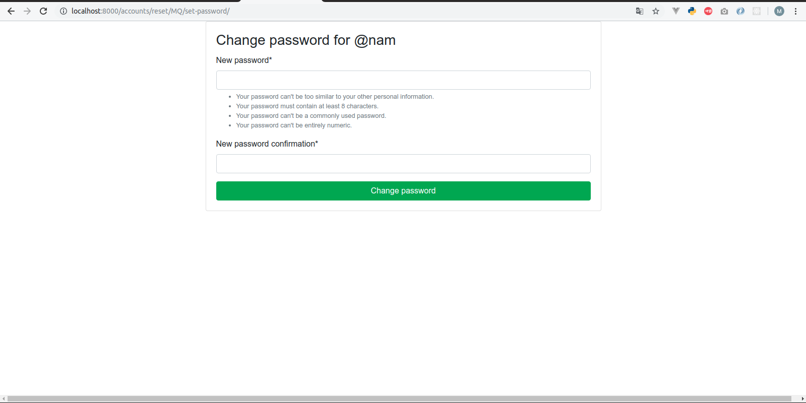
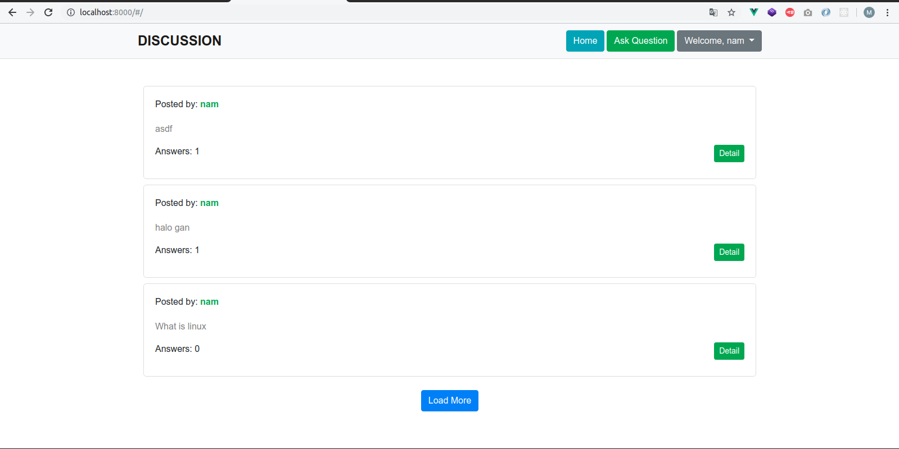
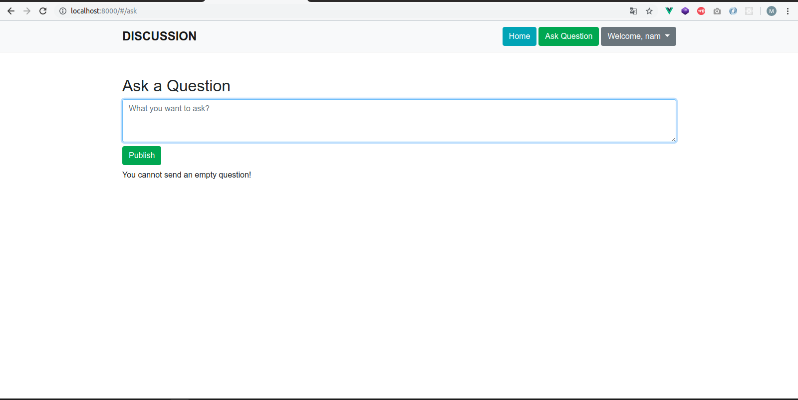
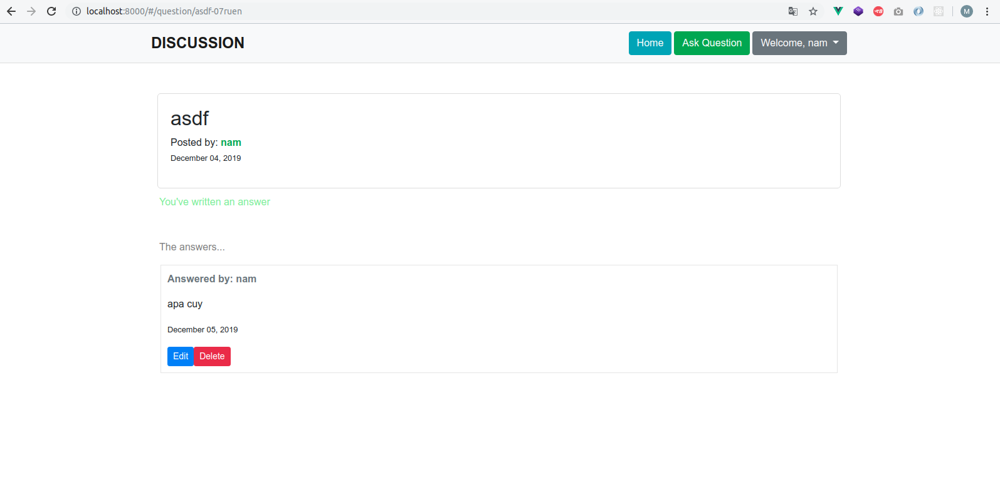

## DISCUSSION 

This project is using **Django(2+), Django Rest Framework & Vue Js/CLI** 

The type of this application is SPA (Single Page Application) that use **Session Authentication.** combine Django Framework & Vue JS.

And also support for **Token Based Authentication** (You can using Angular/ReactJs(Native)/Vue in separate service).

### Here these sample images of this application

**Login page**

**Registration Page**

**Forgot Password**

**Forgot link already sent**

**Form Change Password after click the link for Forgot password**

**Dashboard Page**

**Form Ask a Question Page**

**Answer detail Page**
